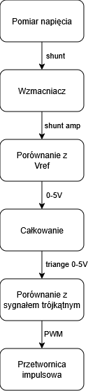
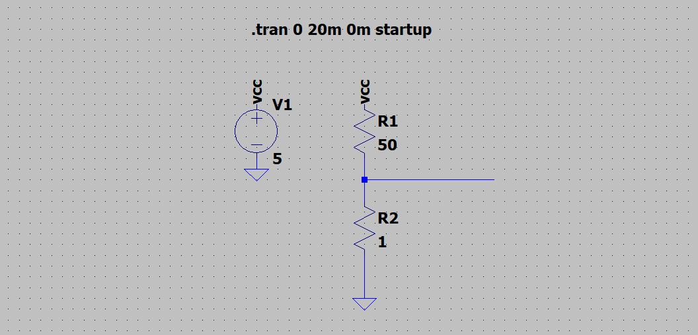
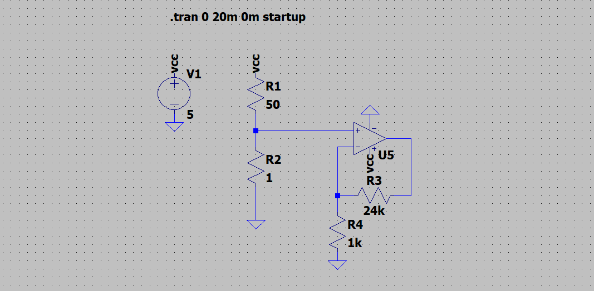
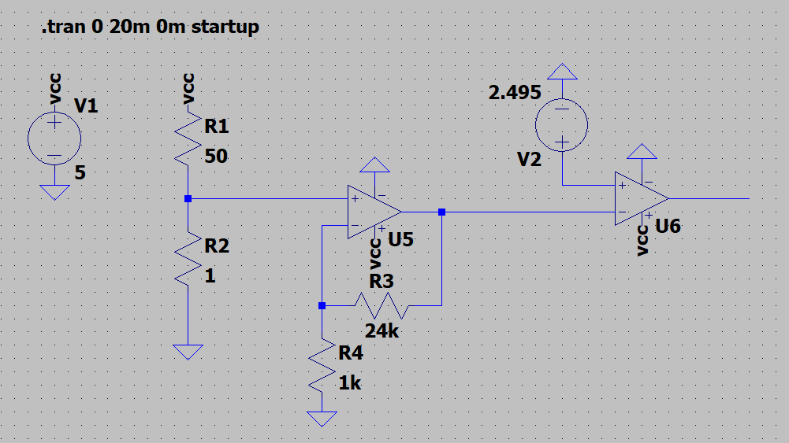
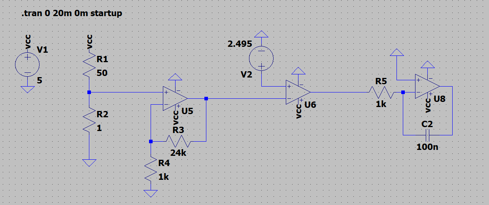
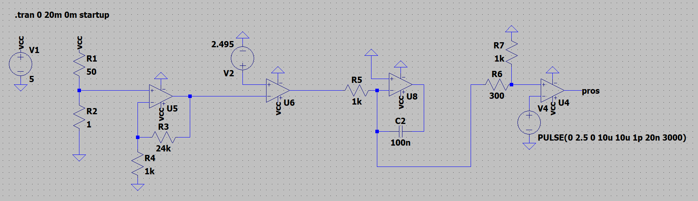
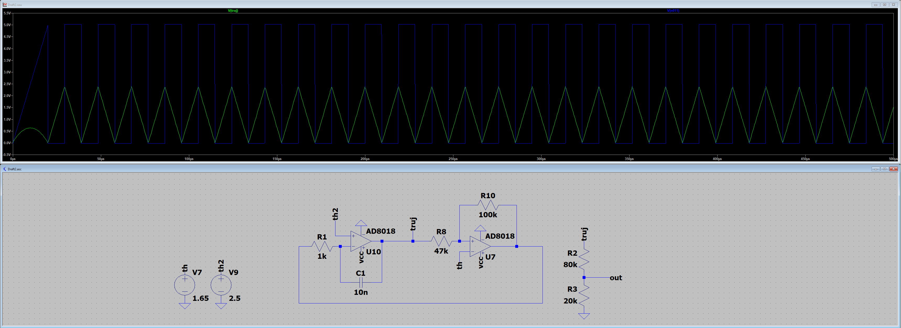
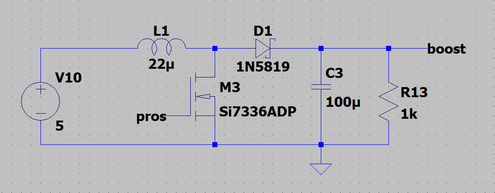
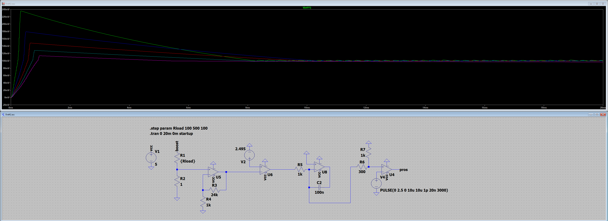
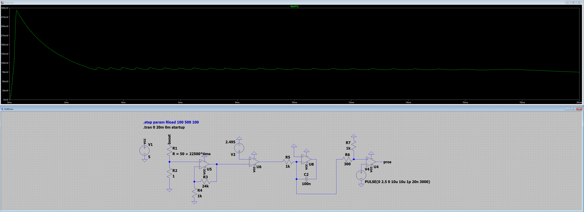

# Cel projetku:
Stworzenie zasilacza stałoprądowego utrzymującego stały przepływ ustalonego prądu niezależnie od zmiany obciążenia.

# Schemat blokowy:

  

# Działanie układu:

## 1) Pomiar spadku napięcia na rezystorze pomiarowym

 
Pomiar napięcia na rezystorze R2 (dalej Rshunt) realizowany jest za pomocą prostego dzielnika napięcia. Zastosowanie rezystorów w takiej konfiguracji umożliwia odczyt napięcia bez konieczności użycia wzmacniacza różnicowego. Dodatkowo rozwiązanie to eliminuje problem podawania na wejście wzmacniacza napięcia większego niż jego napięcie zasilania.

## 2) Wzmocnienie napięcia na rezystorze pomiarowym

 
Wzmocnienie napięcia realizowane jest przez wzmacniacz operacyjny w konfiguracji nieodwracającej, dla której ustawiono wartość wzmocnienia równą 
k=25. 

## 3) Porównanie z napięciem odniesienia

 
Porównanie napięć realizowane jest za pomocą wzmacniacza operacyjnego pracującego w konfiguracji komparatora. Układ porównuje wzmocnione napięcie z rezystora z ustalonym napięciem odniesienia o wartości
Uref=2,495 V.

## 4) Przetrzymywanie danych o napięciu rezystora

 
Informacja o stanie napięcia na Rshunt przechowywana jest w układzie integratora. W przypadku gdy spadek napięcia na Rshunt jest zbyt mały, na wejście integratora podawany jest sygnał prostokątny o amplitudzie 5 V, który jest całkowany. W przeciwnym przypadku na wejście układu podawane jest napięcie 0 V.

## 5) Tworzenie sygnału prosokątnego

 
Sygnał sterujący przetwornicą impulsową jest generowany poprzez porównanie napięcia z wyjścia integratora z sygnałem trójkątnym. Wzrost napięcia na kondensatorze integratora powoduje zwiększenie współczynnika wypełnienia sygnału PWM, a tym samym wzrost napięcia zasilającego Rshunt. Powstałe w ten sposób sprzężenie zwrotne umożliwia regulację napięcia, a w konsekwencji także natężenia prądu płynącego przez rezystor pomiarowy.

Dzielnik napięcia przy ostatnim komparatorze ogranicza maksymalne napięcie doprowadzane do jego wejścia. Bez tego elementu napięcie na kondensatorze integratora mogłoby osiągnąć 5 V, co spowodowałoby uzyskanie 100% wypełnienia sygnału PWM. W rezultacie tranzystor kluczujący pozostawałby stale w stanie przewodzenia, co mogłoby doprowadzić do zwarcia zasilania VCC z masą GND.

# Tworzenie napięcie trójkątnego:

 
Sygnał trójkątny generowany jest przy użyciu układu integratora oraz przerzutnika Schmitta.
Kondensator C1 ładuje się przez rezystor 
R1, co powoduje liniowy wzrost napięcia na jego okładkach. Proces ten trwa do momentu osiągnięcia górnego progu przełączania przerzutnika Schmitta. Po jego przekroczeniu następuje zmiana stanu wyjścia przerzutnika, co odwraca kierunek przepływu prądu w obwodzie integratora.
W konsekwencji kondensator rozpoczyna rozładowywanie się ze stałą szybkością, aż do osiągnięcia dolnego progu przełączania przerzutnika. Po jego przekroczeniu przerzutnik ponownie zmienia stan, a cykl powtarza się cyklicznie.
W rezultacie na kondensatorze C1 otrzymujemy przebieg trójkątny, natomiast na wyjściu przerzutnika Schmitta pojawia się przebieg prostokątny o tej samej częstotliwości.
Dzielnik napięcia złożony z rezystorów R2–R3 (w praktyce zrealizowany jako potencjometr) umożliwia precyzyjne ustawienie poziomunapięcia sterującego w zakresie od 0 do 2,5 V.
Napięcia oznaczone jako „th” oraz „th2” służą do dokładnego dopasowania kształtu sygnału.

# Przetwornica impulsowa:

 
Przetwornica impulsowa została zrealizowana w możliwie najprostszej postaci.

# Symulacje układu:
## Stałe wartości

 
Wyniki tej symulacji potwierdzają poprawne działanie układu. W symulacji analizowano różne wartości rezystancji obciążenia Rload, co skutkowało różnymi początkowymi wartościami prądu w układzie pomiarowym. Niezależnie od warunków początkowych układ dąży do ustalenia spadku napięcia na Rshunt na poziomie 100 mV i utrzymuje tę wartość w stanie ustalonym.

## Zmienna wartość

 
Wyniki symulacji potwierdzają poprawne działanie układu. W przeprowadzonej analizie sprawdzono, czy układ jest w stanie osiągnąć oraz utrzymać stałą wartość prądu pomimo zmiennej rezystancji obciążenia Rload, której wartość zwiększa się stukrotnie w trakcie symulacji. Wyniki pokazują, że układ skutecznie kompensuje zmianę obciążenia i utrzymuje stały prąd.  