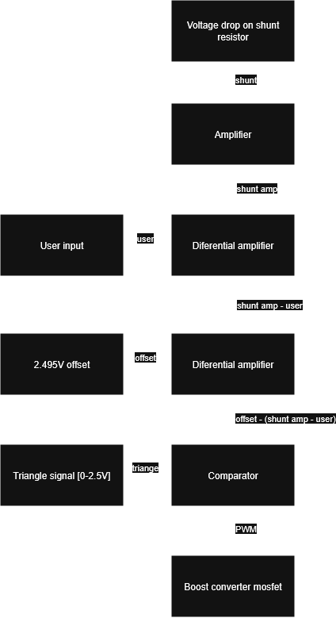

# Cel projetku:
Stworzenie zasilacza stałoprądowego utrzymującego stały przepływ ustalonego prądu niezależnie od zmiany obciążenia.

# Schemat blokowy:

# Zasada działania:
Układ realizuje pomiar prądu obciążenia poprzez pomiar spadku napięcia na rezystorze pomiarowym (bocznikowym), którego rezystancja jest pomijalnie mała w stosunku do rezystancji obciążenia. Zmierzone napięcie jest następnie wzmacniane w taki sposób, aby przy maksymalnym dopuszczalnym prądzie jego wartość osiągała 2,5 V.

Użytkownik ustawia napięcie zadane, odpowiadające żądanej wartości prądu. Napięcie to jest odejmowane od wzmocnionego napięcia pomiarowego. W ten sposób układ regulacji „koryguje” wartość mierzonego prądu, porównując ją z wartością zadaną. Otrzymana różnica napięć reprezentuje uchyb regulacji.

Sygnał uchybu jest następnie odejmowany od precyzyjnego napięcia odniesienia o wartości 2,495 V. Tak otrzymane napięcie jest porównywane z chwilową wartością napięcia o przebiegu trójkątnym w zakresie 0–2,5 V. W wyniku tego porównania powstaje sygnał prostokątny PWM, którego współczynnik wypełnienia zależy od wartości napięcia sterującego – im bliżej napięcia odniesienia znajduje się sygnał porównywany, tym większe jest wypełnienie sygnału PWM.

Wygenerowany sygnał PWM steruje bramką tranzystora NMOS, który reguluje czas przewodzenia w przetwornicy impulsowej, a tym samym czas ładowania cewki.

W przypadku zwiększenia obciążenia spadek napięcia na rezystorze pomiarowym maleje, co powoduje zmianę napięcia uchybu. W konsekwencji zwiększa się współczynnik wypełnienia sygnału PWM. Powoduje to wydłużenie czasu przewodzenia tranzystora, wzrost energii magazynowanej w cewce oraz podniesienie napięcia wyjściowego przetwornicy. W efekcie wzrasta prąd płynący przez obciążenie, co prowadzi do przywrócenia zadanej wartości prądu.

# Symulacje układu
## Utowrzenie sygnału trujkątnego:

Sygnał trójkątny generowany jest przy użyciu integratora oraz przerzutnika Schmitta.

Kondensator C1 ładuje się przez rezystor R1, co powoduje liniowy wzrost napięcia na jego okładkach. Proces ten trwa do momentu osiągnięcia górnego progu przełączania przerzutnika Schmitta. Po przekroczeniu tej wartości następuje zmiana stanu wyjścia przerzutnika, co powoduje odwrócenie kierunku przepływu prądu w obwodzie integratora.

W konsekwencji kondensator zaczyna się rozładowywać ze stałą szybkością, aż do osiągnięcia dolnego progu przełączania przerzutnika. Po jego przekroczeniu przerzutnik ponownie zmienia stan, a cykl się powtarza.

W rezultacie na kondensatorze C1 otrzymujemy przebieg trójkątny, natomiast na wyjściu przerzutnika Schmitta — przebieg prostokątny o tej samej częstotliwości.

Dzielnik napięcia złożony z rezystorów R2–R3 (zrealizowany w praktyce jako potencjometr) służy do precyzyjnego ustawienia poziomu napięcia sterującego w zakresie od 0 do 2,5 V.

Napięcia "th" oraz "th2" są urzywane do dokładnego ustawienia kształtu sygnału.